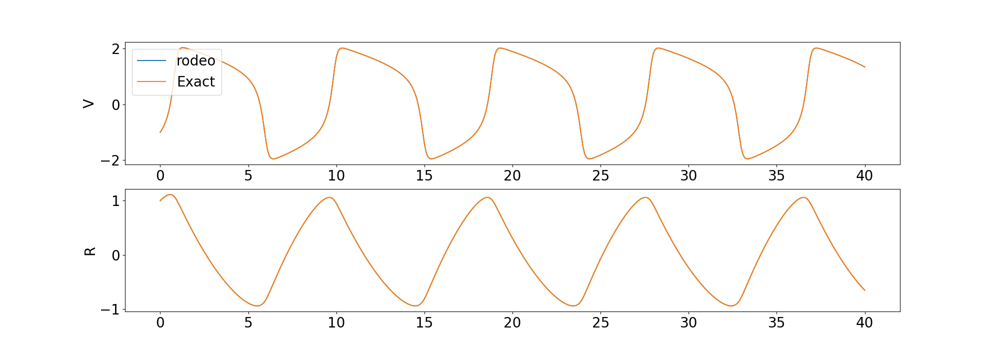
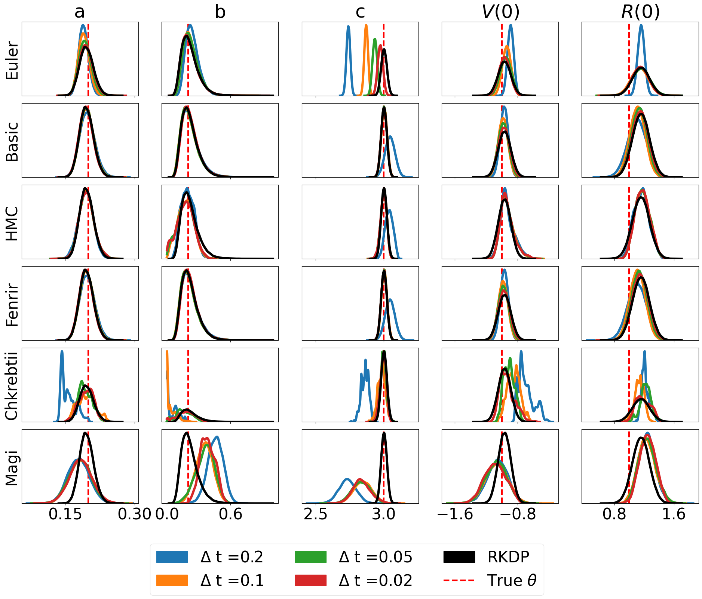

# **rodeo:** Probabilistic ODE Solver

[**Home**](https://rodeo.readthedocs.io/)
| [**Installation**](#installation)
| [**Documentation**](#documentation)
| [**Developers**](#developers)
| [**Tutorial**](#walkthrough)

---

## Description

**rodeo** is a fast and flexible Python library that uses [probabilistic numerics](http://probabilistic-numerics.org/) to solve ordinary differential equations (ODEs).  That is, most ODE solvers (such as [Euler's method](https://en.wikipedia.org/wiki/Euler_method)) produce a deterministic approximation to the ODE on a grid of size $\delta$.  As $\delta$ goes to zero, the approximation converges to the true ODE solution.  Probabilistic solvers such as **rodeo** also output a solution an a grid of size $\delta$; however, the solution is random.  Still, as $\delta$ goes to zero, the probabilistic numerical approximation converges to the true solution. 

**rodeo** provides several probabilistic ODE solvers with a Bayesian filtering paradigm common to many probabilistic solvers [Tronarp et al (2018)](http://arxiv.org/abs/1810.03440). This begins by putting a [Gaussian process](https://en.wikipedia.org/wiki/Gaussian_process) prior on the ODE solution, and updating it sequentially as the solver steps through the grid. **rodeo** is built on **jax** which allows for just-in-time compilation and auto-differentiation. The API of **jax** is almost equivalent to that of **numpy**. A brief summary of the solvers available in this library:

- `rodeo`: Implementations of our ODE solver.
- `fenrir`: Implementations of Fenrir [Tronarp et al (2022)](https://proceedings.mlr.press/v162/tronarp22a.html).
- `oc_mcmc`: MCMC implementation of Chkrebtii's solver [Chkrebtii et al (2016)](https://projecteuclid.org/euclid.ba/1473276259).
- `dalton`: Implementation of our data-adaptive ODE solver.

Please note that this is the **jax**-only version of **rodeo**. For the legacy versions using various other backends please see [here](https://github.com/mlysy/rodeo-legacy).

## Installation

Download the repo from GitHub and then install with the `setup.cfg` script:
```bash
git clone https://github.com/mlysy/rodeo.git
cd rodeo
pip install .
```

## Documentation

Please first go to [readthedocs](https://rodeo.readthedocs.io/) and then see the documentation for the following examples. 

- A [quickstart tutorial](docs/examples/tutorial.md).

- An example of [higher-ordered ODE](docs/examples/higher_order.md).

- An example of a difficult [chaotic ODE](docs/examples/lorenz.md).

- An example of parameter inference using [Laplace Approximation](docs/examples/parameter.md).

## Developers

### Unit Testing

The unit tests can be ran through the following commands:
```bash
cd tests
python -m unittest discover -v
```

Or, install [**tox**](https://tox.wiki/en/latest/index.html), then from within `rodeo` enter command line: `tox`.

### Building Documentation

The HTML documentation can be compiled from the root folder:
```bash
pip install .[docs]
cd docs
make html
```
This will create the documentation in `docs/build`.

## Walkthrough

To illustrate the set-up, let's consider the following ODE example (**FitzHugh-Nagumo** model) where the number of derivatives is $q=1$ for both variables:

$$
\begin{align*}
    \frac{dV}{dt} &= c(V - \frac{V^3}{3} + R), \\
    \frac{dR}{dt} &= -\frac{(V - a - bR)}{c}, \\
    X(0) &= (V(0), R(0)) = (-1,1).
\end{align*}
$$

where the solution $X(t)$ is sought on the interval $t \in [0, 40]$ and $\theta = (a,b,c) = (.2,.2,3)$.  

To approximate the solution with the probabilistic solver, the Gaussian process prior we will use is a so-called 
[Continuous Autoregressive Process](https://CRAN.R-project.org/package=cts/vignettes/kf.pdf) of order $p$. 
A particularly simple $\mathrm{CAR}(p)$ proposed by [Schober](http://link.springer.com/10.1007/s11222-017-9798-7) is the 
$p-1$ times integrated Brownian motion, 

$$
\begin{equation*}
\boldsymbol{X(t)} \sim \mathrm{IBM}(p).
\end{equation*}
$$

Here $\boldsymbol{X(t)} = \big(X(t)^{(0)}, \ldots, X(t)^{(p-1)}\big)$ consists of $x(t)$ and its first $p-1$ derivatives. 
The $\mathrm{IBM}(p)$ model specifies that each of these is continuous, but $X^{(p)}(t)$ is not. 
Therefore, we need to pick $p > q$. It's usually a good idea to have $p$ a bit larger than $q$, especially when 
we think that the true solution $X(t)$ is smooth. However, increasing $p$ also increases the computational burden, 
and doesn't necessarily have to be large for the solver to work.  For this example, we will use $p=3$. 
To initialize, we simply set $\boldsymbol{X(0)} = (X(0), 0)$. The Python code to implement all this is as follows.

```python
import jax
import jax.numpy as jnp
import numpy as np
import matplotlib.pyplot as plt
from scipy.integrate import odeint

from rodeo.ibm import ibm_init
from rodeo.ode import *
from jax.config import config
config.update("jax_enable_x64", True)

# RHS of ODE
from math import sin, cos
def fitz(X_t, t, theta):
    "FitzHugh-Nagumo ODE."
    a, b, c = theta
    V, R = X_t[:,0]
    return jnp.array([[c*(V - V*V*V/3 + R)],
                    [-1/c*(V - a + b*R)]])

# problem setup and intialization
n_deriv = 1  # Total state
n_obs = 2  # Total observations
n_deriv_prior = 3

# it is assumed that the solution is sought on the interval [tmin, tmax].
n_eval = 800
tmin = 0.
tmax = 40.
theta = jnp.array([0.2, 0.2, 3])

# The rest of the parameters can be tuned according to ODE
# For this problem, we will use
sigma = .01
sigma = jnp.array([sigma]*n_obs)

# Initial W for jax block
W_mat = np.zeros((n_obs, 1, n_deriv_prior))
W_mat[:, :, 1] = 1
W_block = jnp.array(W_mat)

# Initial x0 for jax block
x0_block = jnp.array([[-1., 1., 0.], [1., 1/3, 0.]])

# Get parameters needed to run the solver
dt = (tmax-tmin)/n_eval
n_order = jnp.array([n_deriv_prior]*n_obs)
ode_init = ibm_init(dt, n_order, sigma)

# Jit solver
key = jax.random.PRNGKey(0)
mv_jit = jax.jit(solve_mv, static_argnums=(1, 6))
xt, _ = mv_jit(key=key, fun=fitz,
               x0=x0_block, theta=theta,
               tmin=tmin, tmax=tmax, n_eval=n_eval,
               wgt_meas=W_block, **ode_init)
```

We compare the solution from the solver to the deterministic solution provided by `odeint` in the **scipy** library. 



## Parameter Inference

Probabilistic solvers in **rodeo** are capable of parameter inference. Here, we provide a simple likelihood estimation of the model parameters $\boldsymbol{\Theta} = (a, b, c, V(0), R(0))$ with $a,b,c > 0$ in the **FitzHugh-Nagumo** ODE. Suppose observations are simulated via the model

$$
Y(t) \sim \mathcal{N}(X(t), \phi^2 \cdot \boldsymbol{I}_{2\times 2})
$$

where $t=0, 1, \ldots, 40$ and $\phi^2 = 0.005$. For simplicity, we choose a flat prior for $\boldsymbol{\Theta}$ then the following function can be used to compute the likelihood approximation of $\boldsymbol{\Theta}$.

```python
# Suppose Y_t is simulated from the observation model above.
def loglikelihood(Theta):
    r"Compute the negative loglikihood of :math:`Y_t`."
    # get initial value and theta from Theta
    x0 = Theta[3:].reshape((2,1))
    theta = Theta[:3]
    # compute initial dR(0), and dV(0)
    v0 = fitz(x0, 0, theta)
    # zero pad as above
    x0 = jnp.hstack([x0, v0, jnp.zeros(shape=(x0.shape))])
    # compute solution
    xt, _ = solve_mv(key=key, fun=fitz,
                     x0=x0, theta=theta,
                     tmin=tmin, tmax=tmax, n_eval=n_eval,
                     wgt_meas=W_block, **ode_init)
    # keep only the points where Y_t exists
    X_t = X_t[::20, :, 0] 
    # compute loglikelihood
    lp = jnp.sum(jsp.stats.norm.logpdf(x=Y_t, loc=X_t, scale=jnp.sqrt(0.005)))
    return lp
```

This is a basic example to demonstrate usage. we suggest more sophisticated likelihood approximations which propagate the solution uncertainty to the likelihood approximation such as `fenrir`, `oc_mcmc` and `dalton`. Please refer to the [parameter inference tutorial](docs/examples/parameter.md) for more details.

## Results

Here are some results produced by solvers in **rodeo** from `/examples/`:

### FitzHugh-Nagumo



### SEIRAH


### Hes1


