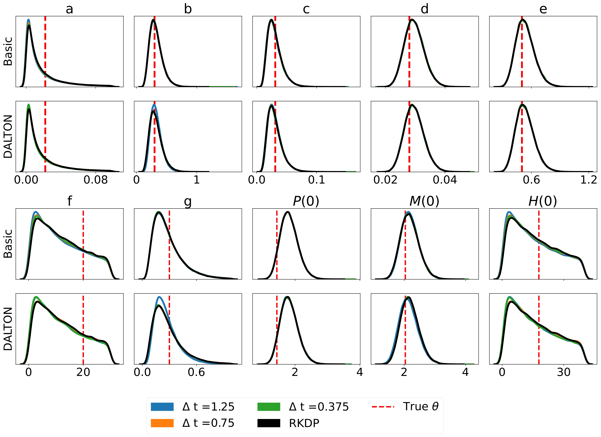

# **rodeo:** Probabilistic ODE Solver

[**Home**](https://rodeo.readthedocs.io/)
| [**Installation**](#installation)
| [**Documentation**](#documentation)
| [**Developers**](#developers)
| [**Tutorial**](#walkthrough)

---

## Description

**rodeo** is a fast and flexible Python library that uses [probabilistic numerics](http://probabilistic-numerics.org/) to solve ordinary differential equations (ODEs).  That is, most ODE solvers (such as [Euler's method](https://en.wikipedia.org/wiki/Euler_method)) produce a deterministic approximation to the ODE on a grid of size $\delta$.  As $\delta$ goes to zero, the approximation converges to the true ODE solution.  Probabilistic solvers such as **rodeo** also output a solution an a grid of size $\delta$; however, the solution is random.  Still, as $\delta$ goes to zero, the probabilistic numerical approximation converges to the true solution. 

**rodeo** provides a lightweight and extensible family of approximations to a nonlinear Bayesian filtering paradigm common to many probabilistic solvers [Tronarp et al (2018)](http://arxiv.org/abs/1810.03440). This begins by putting a [Gaussian process](https://en.wikipedia.org/wiki/Gaussian_process) prior on the ODE solution, and updating it sequentially as the solver steps through the grid. **rodeo** is built on **jax** which allows for just-in-time compilation and auto-differentiation. The API of **jax** is almost equivalent to that of **numpy**. A brief summary of the methods available in this library:

- `rodeo`: Implementations of our ODE solver.
- `fenrir`: Implementations of Fenrir [Tronarp et al (2022)](https://proceedings.mlr.press/v162/tronarp22a.html).
- `marginal_mcmc`: MCMC implementation of Chkrebtii's method [Chkrebtii et al (2016)](https://projecteuclid.org/euclid.ba/1473276259).
- `dalton`: Implementation of our data-adaptive ODE likelihood approximation [Wu and Lysy (2023)](https://arxiv.org/abs/2306.05566).

Please note that this is the **jax**-only version of **rodeo**. For the legacy versions using various other backends please see [here](https://github.com/mlysy/rodeo-legacy).

## Installation

Download the repo from GitHub and then install with the `setup.cfg` script:
```bash
git clone https://github.com/mlysy/rodeo.git
cd rodeo
pip install .
```

## Documentation

Please first go to [readthedocs](https://rodeo.readthedocs.io/) and then see the documentation for the following examples. 

- A [quickstart tutorial](docs/examples/tutorial.md).

- An example of [higher-ordered ODE](docs/examples/higher_order.md).

- An example of a difficult [chaotic ODE](docs/examples/lorenz.md).

- An example of parameter inference using [Laplace Approximation](docs/examples/parameter.md).

## Developers

### Unit Testing

The unit tests can be ran through the following commands:
```bash
cd tests
python -m unittest discover -v
```

Or, install [**tox**](https://tox.wiki/en/latest/index.html), then from within `rodeo` enter command line: `tox`.

### Building Documentation

The HTML documentation can be compiled from the root folder:
```bash
pip install .[docs]
cd docs
make html
```
This will create the documentation in `docs/build`.

## Walkthrough

To illustrate the set-up, let's consider the following ODE example (**FitzHugh-Nagumo** model) where the number of derivatives is $p-1=1$ for both variables:

$$
\begin{align*}
    \frac{dV}{dt} &= c(V - \frac{V^3}{3} + R), \\
    \frac{dR}{dt} &= -\frac{(V - a - bR)}{c}, \\
    X(0) &= (V(0), R(0)) = (-1,1).
\end{align*}
$$

where the solution $X(t)$ is sought on the interval $t \in [0, 40]$ and $\theta = (a,b,c) = (.2,.2,3)$.  

To approximate the solution with the probabilistic solver, the Gaussian process prior we will use is a so-called 
[Continuous Autoregressive Process](https://CRAN.R-project.org/package=cts/vignettes/kf.pdf) of order $q$. 
A particularly simple $\mathrm{CAR}(q)$ proposed by [Schober](http://link.springer.com/10.1007/s11222-017-9798-7) is the 
$q-1$ times integrated Brownian motion, 

$$
\begin{equation*}
\boldsymbol{X(t)} \sim \mathrm{IBM}(q).
\end{equation*}
$$

Here $\boldsymbol{X(t)} = \big(X(t)^{(0)}, \ldots, X(t)^{(q-1)}\big)$ consists of $x(t)$ and its first $q-1$ derivatives. 
The $\mathrm{IBM}(q)$ model specifies that each of these is continuous, but $X^{(q)}(t)$ is not. 
Therefore, we need to pick $q \geq p$. It's usually a good idea to have $q$ a bit larger than $p$, especially when 
we think that the true solution $X(t)$ is smooth. However, increasing $q$ also increases the computational burden, 
and doesn't necessarily have to be large for the solver to work.  For this example, we will use $q=3$. 
To initialize, we simply set $\boldsymbol{X(0)} = (X(0), 0)$. The Python code to implement all this is as follows.

```python
import jax
import jax.numpy as jnp
import rodeo

def fitz_fun(X, t, **params):
    "FitzHugh-Nagumo ODE in rodeo format."
    a, b, c = params["theta"]
    V, R = X[:, 0]
    return jnp.array(
        [[c * (V - V * V * V / 3 + R)],
         [-1 / c * (V - a + b * R)]]
    )

W = jnp.array([[[0., 1., 0.]], [[0., 1., 0.]]])  # LHS matrix of ODE
x0 = jnp.array([-1., 1.])  # initial value for the ODE-IVP
theta = jnp.array([.2, .2, 3])  # ODE parameters
X0 = fitz_init(x0, theta)  # initial value in rodeo format

# Time interval on which a solution is sought.
t_min = 0.
t_max = 40.

# --- Define the prior process -------------------------------------------

n_vars = 2                        # number of variables in the ODE
n_deriv = 3  # max number of derivatives
sigma = jnp.array([.1] * n_vars)  # IBM process scale factor


# --- data simulation ------------------------------------------------------

n_steps = 800                  # number of evaluations steps
dt = (t_max - t_min) / n_steps  # step size

# generate the Kalman parameters corresponding to the prior
prior_Q, prior_R = rodeo.prior.ibm_init(
    dt=dt_sim,
    n_deriv=n_deriv,
    sigma=sigma
)

# Produce a Pseudo-RNG key
key = jax.random.PRNGKey(0)

Xt, _ = rodeo.solve_mv(
    key=key,
    # define ode
    ode_fun=fitz_fun,
    ode_weight=W,
    ode_init=X0,
    t_min=t_min,
    t_max=t_max,
    theta=theta,  # ODE parameters added here
    # solver parameters
    n_steps=n_steps,
    interrogate=rodeo.interrogate.interrogate_kramer,
    prior_weight=prior_Q,
    prior_var=prior_R
)
```

We compare the solution from the solver to the deterministic solution provided by `odeint` in the **scipy** library. 


## Parameter Inference

Probabilistic solvers in **rodeo** are capable of parameter inference. Here, we provide a simple likelihood estimation of the model parameters $\boldsymbol{\Theta} = (a, b, c, V(0), R(0))$ with $a,b,c > 0$ in the **FitzHugh-Nagumo** ODE. Suppose observations are simulated via the model

$$
Y(t) \sim \mathcal{N}(X(t), \phi^2 \cdot \boldsymbol{I}_{2\times 2})
$$

where $t=0, 1, \ldots, 40$ and $\phi^2 = 0.005$. For simplicity, we choose a flat prior for $\boldsymbol{\Theta}$ then the following function can be used to compute the likelihood approximation of $\boldsymbol{\Theta}$.

```python
# Suppose Y_t is simulated from the observation model above.

def fitz_init(x0, theta):
    "FitzHugh-Nagumo initial values in rodeo format."
    x0 = x0[:, None]
    return jnp.hstack([
        x0,
        fitz_fun(X=x0, t=0., theta=theta),
        jnp.zeros_like(x0)
    ])

def fitz_logprior(upars):
    "Logprior on unconstrained model parameters."
    n_theta = 5  # number of ODE + IV parameters
    lpi = jax.scipy.stats.norm.logpdf(
        x=upars[:n_theta],
        loc=0.,
        scale=10.
    )
    return jnp.sum(lpi)


def fitz_loglik(obs_data, ode_data, **params):
    """
    Loglikelihood for measurement model.

    Args:
        obs_data (ndarray(n_obs, n_vars)): Observations data.
        ode_data (ndarray(n_obs, n_vars, n_deriv)): ODE solution.
    """
    ll = jax.scipy.stats.norm.logpdf(
        x=obs_data,
        loc=ode_data[:, :, 0],
        scale=noise_sd
    )
    return jnp.sum(ll)


def constrain_pars(upars, dt):
    """
    Convert unconstrained optimization parameters into rodeo inputs.

    Args:
        upars : Parameters vector on unconstrainted scale.
        dt : Discretization grid size.

    Returns:
        tuple with elements:
        - theta : ODE parameters.
        - X0 : Initial values in rodeo format.
        - Q, R : Prior matrices.
    """
    theta = jnp.exp(upars[:3])
    x0 = upars[3:5]
    X0 = fitz_init(x0, theta)
    sigma = upars[5:]
    Q, R = rodeo.prior.ibm_init(
        dt=dt,
        n_deriv=n_deriv,
        sigma=sigma
    )
    return theta, X0, Q, R


def neglogpost_basic(upars):
    "Negative logposterior for basic approximation."
    # solve ODE
    theta, X0, prior_Q, prior_R = constrain_pars(upars, dt_sim)
    # basic loglikelihood
    ll = rodeo.inference.basic(
        key=key, 
        # ode specification
        ode_fun=fitz_fun,
        ode_weight=W,
        ode_init=X0,
        t_min=t_min,
        t_max=t_max,
        theta=theta,
        # solver parameters
        n_steps=n_steps,
        interrogate=rodeo.interrogate.interrogate_kramer,
        prior_weight=prior_Q,
        prior_var=prior_R,
        # observations
        obs_data=Y,
        obs_times=obs_times,
        obs_loglik=fitz_loglik
    )
    return -(ll + fitz_logprior(upars))
```

This is a basic example to demonstrate usage. we suggest more sophisticated likelihood approximations which propagate the solution uncertainty to the likelihood approximation such as `fenrir`, `oc_mcmc` and `dalton`. Please refer to the [parameter inference tutorial](docs/examples/parameter.md) for more details.

## Results

Here are some results produced by solvers in **rodeo** from `/examples/`:

### FitzHugh-Nagumo


### SEIRAH


### Hes1



