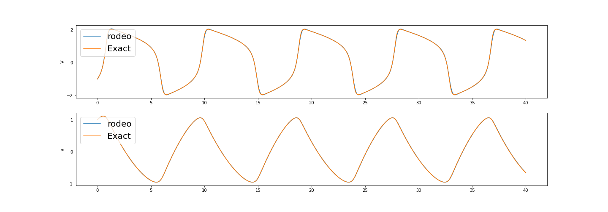
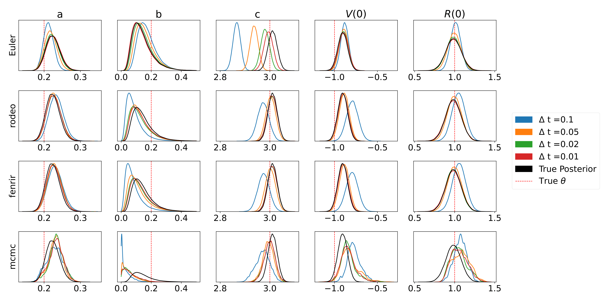
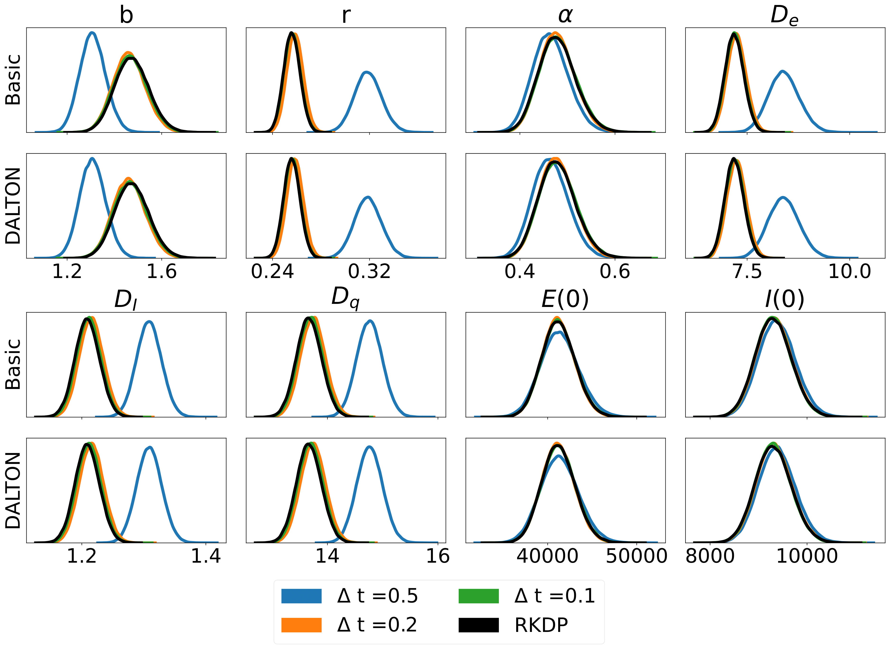
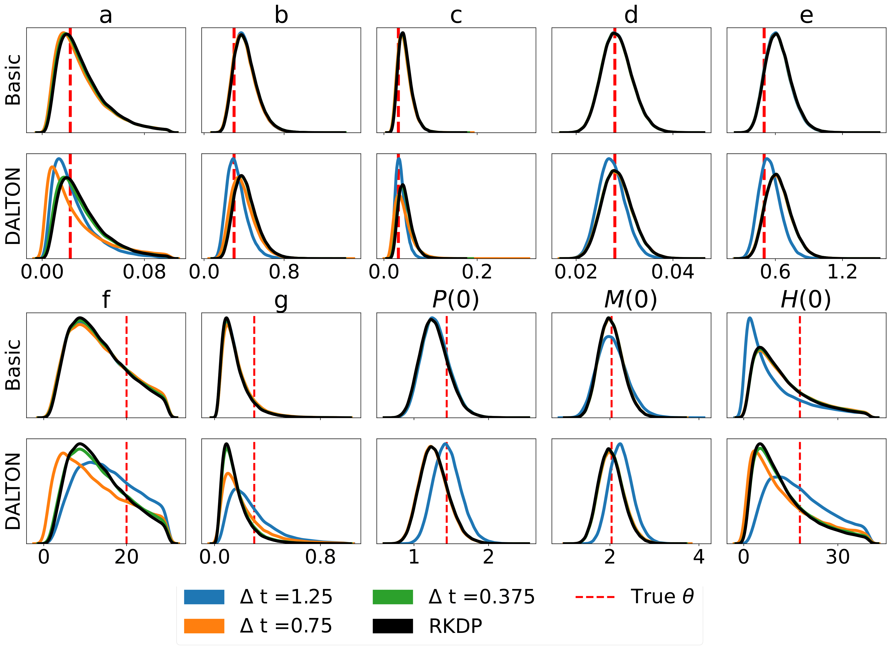

.. rodeo documentation master file

************************
pRobabilistic ODE sOlver
************************

Description
===========

**rodeo** is a fast and flexible Python library uses [probabilistic numerics](http://probabilistic-numerics.org/) to solve ordinary differential equations (ODEs).  That is, most ODE solvers (such as [Euler's method](https://en.wikipedia.org/wiki/Euler_method)) produce a deterministic approximation to the ODE on a grid of size :math:`\delta`.  As :math:`\delta` goes to zero, the approximation converges to the true ODE solution.  Probabilistic solvers such as **rodeo** also output a solution an a grid of size :math:`\delta`; however, the solution is random.  Still, as :math:`\delta` goes to zero, the probabilistic numerical approximation converges to the true solution. 

**rodeo** implements the probabilistic solver of [Chkrebtii et al (2016)](https://projecteuclid.org/euclid.ba/1473276259). This begins by putting a [Gaussian process](https://en.wikipedia.org/wiki/Gaussian_process) prior on the ODE solution, and updating it sequentially as the solver steps through the grid. **rodeo** is built on **jax** which allows for just-in-time compilation and auto-differentiation. The API of **jax** is almost equivalent to that of **numpy**.

Please note that this is the **jax**-only version of **rodeo**. For the legacy versions using various other backends please see [here](https://github.com/mlysy/rodeo).

Installation
============

You can get the very latest code by getting it from GitHub and then performing the installation.

.. code-block:: bash

    git clone https://github.com/mlysy/rodeo-jax.git
    cd rodeo-jax
    pip install .

Unit Testing
============

The unit tests can be ran through the following commands:

.. code-block:: bash

    cd tests
    python -m unittest discover -v

Or, install [**tox**](https://tox.wiki/en/latest/index.html), then from within `rodeo-jax` enter command line: `tox`.

Walkthrough
===========

To illustrate the set-up, let's consider the following ODE example (**FitzHugh-Nagumo** model) where :math:`q=1`` for both variables:

.. math::
    \begin{align*}
        \frac{dV}{dt} &= c(V - \frac{V^3}{3} + R), \\
        \frac{dR}{dt} &= -\frac{(V - a - bR)}{c}, \\
        \boldsymbol{x(0)} &= (V(0), R(0)) = (-1,1).
    \end{align*}

where the solution :math:`x_t` is sought on the interval :math:`t \in [0, 40]` and :math:`\theta = (a,b,c) = (.2,.2,3)`.  

To approximate the solution with the probabilistic solver, the Gaussian process prior we will use is a so-called 
[Continuous Autoregressive Process](https://CRAN.R-project.org/package=cts/vignettes/kf.pdf) of order :math:`p`. 
A particularly simple :math:`\mathrm{CAR}(p)` proposed by [Schober](http://link.springer.com/10.1007/s11222-017-9798-7) is the 
:math:`p-1` times integrated Brownian motion, 

.. math::

    \begin{equation*}
    \boldsymbol{x(t)} \sim \mathrm{IBM}(p).
    \end{equation*}

Here :math:`\boldsymbol{x(t)} = \big(x(t)^{(0)}, ..., x(t)^{(p-1)}\big)` consists of :math:`x(t)` and its first :math:`p-1` derivatives. 
The :math:`\mathrm{IBM}(p)` model specifies that each of these is continuous, but :math:`x^{(p)}(t)` is not. 
Therefore, we need to pick :math:`p > q`. It's usually a good idea to have :math:`p` a bit larger than :math:`q`, especially when 
we think that the true solution :math:`x(t)` is smooth. However, increasing :math:`p` also increases the computational burden, 
and doesn't necessarily have to be large for the solver to work.  For this example, we will use :math:`p=3`. 
To initialize, we simply set :math:`\boldsymbol{x(0)} = (\boldsymbol{x}_0, 0)`. The Python code to implement all this is as follows.

.. code-block:: python

    import jax
    import jax.numpy as jnp
    import numpy as np
    import matplotlib.pyplot as plt
    from scipy.integrate import odeint

    from rodeo.ibm import ibm_init
    from rodeo.ode import *
    from jax.config import config
    config.update("jax_enable_x64", True)

.. code-block:: python

    # RHS of ODE
    from math import sin, cos
    def ode_fun_jax(X_t, t, theta):
        "FitzHugh-Nagumo ODE."
        a, b, c = theta
        V, R = X_t[:,0]
        return jnp.array([[c*(V - V*V*V/3 + R)],
                        [-1/c*(V - a + b*R)]])

    # problem setup and intialization
    n_deriv = 1  # Total state
    n_obs = 2  # Total observations
    n_deriv_prior = 3

    # it is assumed that the solution is sought on the interval [tmin, tmax].
    n_eval = 800
    tmin = 0.
    tmax = 40.
    theta = jnp.array([0.2, 0.2, 3])

    # The rest of the parameters can be tuned according to ODE
    # For this problem, we will use
    sigma = .01
    sigma = jnp.array([sigma]*n_obs)

    # Initial W for jax block
    W_mat = np.zeros((n_obs, 1, n_deriv_prior))
    W_mat[:, :, 1] = 1
    W_block = jnp.array(W_mat)

    # Initial x0 for jax block
    x0_block = jnp.array([[-1., 1., 0.], [1., 1/3, 0.]])

    # Get parameters needed to run the solver
    dt = (tmax-tmin)/n_eval
    n_order = jnp.array([n_deriv_prior]*n_obs)
    ode_init = ibm_init(dt, n_order, sigma)

    # Jit solver
    key = jax.random.PRNGKey(0)
    mv_jit = jax.jit(solve_sim, static_argnums=(1, 6))
    xt = mv_jit(key=key, fun=ode_fun_jax,
            x0=x0_block, theta=theta,
            tmin=tmin, tmax=tmax, n_eval=n_eval,
            wgt_meas=W_block, **ode_init)

We compare the solution from the solver to the deterministic solution provided by **odeint**. 

Results
=======

**rodeo** is also capable of performing parameter inference. The main results for three different ODEs found in `/examples/`:

FitzHugh-Nagumo
---------------

SEIRAH
------

Hes1
----

Functions Documentation
=======================
.. toctree::
   :maxdepth: 1

   ./ode
   ./kalmantv
   ./ibm
   ./gauss_markov
   ./utils
